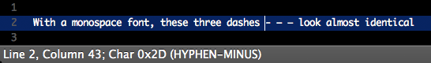

# Character Info

This [Sublime Text](http://www.sublimetext.com/) plugin is helpful for situations like this,
where you want to verify the details of a particular character:

For all [character encodings](http://en.wikipedia.org/wiki/Character_encoding),
the status bar displays the hex code of the character to the right of the cursor.

For [UTF-8](http://en.wikipedia.org/wiki/UTF-8), the Unicode character name is also displayed.
